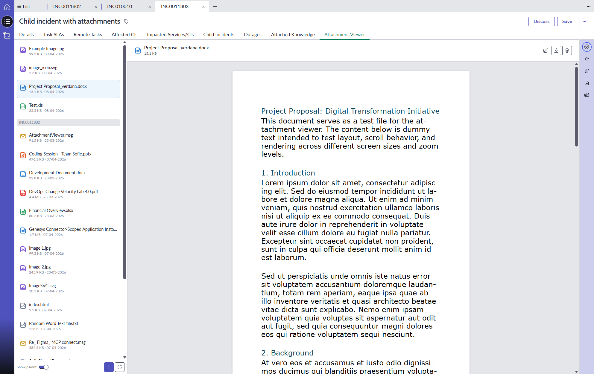

# ServiceNow Attachment Viewer

A full-featured attachment viewer component for ServiceNow's Next Experience (UI Builder). Preview, upload, download, rename, and delete attachments directly from any record — with support for parent record attachments.



## Features

### File Preview
- **PDF** — full embedded viewer
- **Word (.docx)** — rendered with original styling, fonts, and page layout via docx-preview
- **Excel (.xlsx/.xls)** — styled tables with cell colors, fonts, and sheet tabs
- **Email (.msg)** — header (from/to/subject) with HTML body and inline images
- **Images** — jpg, jpeg, png, gif, svg, webp, bmp
- **Text** — txt, log, json, xml, csv, js, ts, html, css
- **PowerPoint (.pptx)** — file icon with download option

### File Management
- **Upload** — via button or drag & drop with file size validation (24MB limit)
- **Download** — direct download from the preview header
- **Rename** — inline rename with extension protection
- **Delete** — with confirmation dialog

### Parent Attachments
- Toggle to show attachments from parent records
- Recursive parent chain traversal (parent > parent's parent > ...)
- Loop detection to prevent infinite recursion
- Resolves actual table type via `sys_class_name`
- Read-only access to parent attachments (no rename/delete)

### UI Components
Built with native ServiceNow components for consistent look and feel:
- `now-button` / `now-button-iconic` — actions
- `now-icon` — colored file type icons
- `now-loader` — loading and upload progress
- `now-message` — dialogs and empty states
- `now-illustration` — empty state artwork
- `now-toggle` — parent attachments toggle
- `now-input` — rename input

### Styling
- ServiceNow design tokens for colors, borders, shadows
- `rgb(var(--now-color--*))` for theme compatibility
- Responsive layout with sidebar and preview pane
- Dynamic height calculation to fit available viewport space

## Properties

| Property | Type | Default | Description |
|----------|------|---------|-------------|
| `table` | string | `incident` | ServiceNow table name |
| `sysid` | string | `""` | Record sys_id |
| `enableParent` | boolean | `false` | Show toggle for parent record attachments |

## Installation

```bash
npm install
```

## Local Development

```bash
snc ui-component develop
```

Opens at `http://localhost:8081`. Test configuration is in `example/element.js`.

## Deploy to ServiceNow

```bash
snc ui-component deploy --instance https://your-instance.service-now.com
```

## Usage in UI Builder

1. Open UI Builder
2. Add the **Attachment Viewer** component to your page
3. Configure the properties:
   - **Table** — bind to the current record's table name
   - **Record Sys ID** — bind to the current record's sys_id
   - **Enable parent attachments** — optionally enable parent attachment viewing

## File Type Icons

| Type | Icon | Color |
|------|------|-------|
| PDF | `document-pdf-outline` | Red |
| Excel | `document-excel-outline` | Green |
| Word | `document-outline` | Blue |
| PowerPoint | `document-powerpoint-outline` | Orange |
| Email | `envelope-outline` | Gold |
| Image | `document-image-outline` | Purple |
| Text | `document-code-outline` | Gray |

## Architecture

```
src/sofbv-attachment-viewer/
  index.js        — component logic, preview rendering, API calls
  styles.scss     — all styling with ServiceNow design tokens
example/
  element.js      — local development test harness
now-ui.json       — UI Builder component configuration
tile-icon/
  paperclip.svg   — component icon for UI Builder
```

## API Endpoints Used

| Endpoint | Method | Purpose |
|----------|--------|---------|
| `/api/now/attachment` | GET | List attachments for a record |
| `/api/now/attachment/{id}/file` | GET | Download attachment content |
| `/api/now/attachment/file` | POST | Upload new attachment |
| `/api/now/attachment/{id}` | DELETE | Delete attachment |
| `/api/now/table/sys_attachment/{id}` | PATCH | Rename attachment |
| `/api/now/table/{table}/{id}` | GET | Get parent record info |
| `/api/now/table/task/{id}` | GET | Resolve parent table type |

## Dependencies

| Package | Purpose |
|---------|---------|
| `docx-preview` | Word document rendering with full styling |
| `xlsx` | Excel parsing with cell styles |
| `msgreader` | Outlook .msg file parsing |
| `@servicenow/now-button` | Button components |
| `@servicenow/now-icon` | File type icons |
| `@servicenow/now-loader` | Loading indicators |
| `@servicenow/now-message` | Dialog layouts |
| `@servicenow/now-illustration` | Empty state artwork |
| `@servicenow/now-toggle` | Parent attachments toggle |
| `@servicenow/now-input` | Input fields |

## License

MIT
